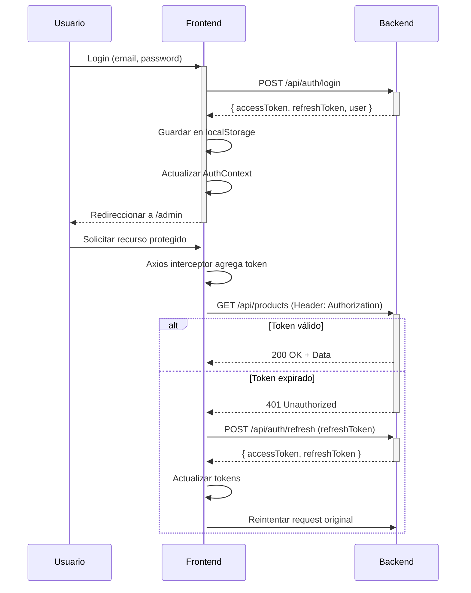

# 📘 Documentación Técnica - igloolab Frontend

## 📑 Tabla de Contenidos

- [Arquitectura del Proyecto](#arquitectura-del-proyecto)
- [Patrones de Diseño](#patrones-de-diseño)
- [Sistema de Autenticación JWT](#sistema-de-autenticación-jwt)
- [Context API](#context-api)
- [Interceptores de Axios](#interceptores-de-axios)
- [Gestión de Estados](#gestión-de-estados)
- [Routing y Protección de Rutas](#routing-y-protección-de-rutas)
- [Integración con Backend](#integración-con-backend)
- [Optimizaciones de Performance](#optimizaciones-de-performance)

---

## 🏗️ Arquitectura del Proyecto

### Estructura de Carpetas

```
src/
├── admin/                    # Módulo administrativo
│   ├── components/          # ProductTable, ProductForm
│   ├── layout/              # AdminLayout con sidebar
│   └── page/                # Dashboard, Medications, Settings
├── app/                      # Módulo público
│   ├── components/          # Navbar, Footer, Hero, Features
│   ├── home/                # HomePage
│   ├── products/            # ProductsPage, ProductCard
│   └── layout/              # LayoutPage principal
├── auth/                     # Autenticación
│   ├── LoginPage.tsx
│   └── RegisterPage.tsx
├── context/                  # Context API (Estado global)
│   ├── AuthContext.tsx      # Autenticación y sesión
│   ├── ProductsContext.tsx  # CRUD de productos
│   ├── DashboardContext.tsx # Estadísticas
│   └── index.tsx            # AppProviders + exports
├── lib/
│   └── api/                  # Capa de servicios
│       ├── client.ts        # Cliente Axios configurado
│       ├── auth.service.ts
│       ├── products.service.ts
│       └── dashboard.service.ts
├── components/
│   ├── ui/                   # shadcn/ui components
│   ├── common/               # Componentes compartidos
│   └── seo/                  # SEO Component
├── types/                    # TypeScript types
│   ├── user.types.ts
│   ├── product.types.ts
│   └── index.ts
├── router/                   # React Router
│   └── AppRouter.tsx
├── hooks/                    # Custom hooks
│   ├── useSEO.ts
│   └── usePreload.ts
├── data/                     # Mock data
│   └── mockData.ts
└── assets/                   # Imágenes optimizadas (.webp)
```

### Principios Arquitectónicos

1. **Separación de Responsabilidades**
   - Módulo `admin` separado de `app` (público)
   - Servicios API centralizados en `lib/api`
   - Tipos TypeScript en carpeta dedicada

2. **Reutilización de Código**
   - Componentes UI compartidos (`components/ui`)
   - Hooks personalizados (`hooks/`)
   - Utilidades comunes (`components/common`)

3. **Escalabilidad**
   - Context API modular (AuthContext, ProductsContext, DashboardContext)
   - Lazy loading de rutas
   - Code splitting automático

---

## 🎨 Patrones de Diseño

### 1. Context + Provider Pattern

Gestión de estado global con Context API:

```typescript
// src/context/index.tsx
export const AppProviders: React.FC<{ children: ReactNode }> = ({ children }) => {
  return (
    <AuthProvider>
      <ProductsProvider>
        <DashboardProvider>
          {children}
        </DashboardProvider>
      </ProductsProvider>
    </AuthProvider>
  )
}
```

### 2. Service Layer Pattern

Capa de abstracción para comunicación con el backend:

```typescript
// src/lib/api/products.service.ts
export const productsService = {
  getAll: async (params) => {
    const response = await apiClient.get('/products', { params })
    return response.data
  },
  
  create: async (data) => {
    const response = await apiClient.post('/products', data)
    return response.data
  }
  // ...
}
```

### 3. Higher-Order Component (HOC)

Protección de rutas con HOC:

```typescript
// src/components/common/ProtectedRoute.tsx
export const ProtectedRoute: React.FC<Props> = ({ children, allowedRoles }) => {
  const { user, loading, isAuthenticated } = useAuthContext()
  
  if (loading) return <DashboardSkeleton />
  if (!isAuthenticated) return <Navigate to="/login" />
  
  return <>{children}</>
}
```

### 4. Render Props Pattern

Manejo de errores con ErrorBoundary:

```typescript
// src/components/common/ErrorBoundary.tsx
<ErrorBoundary fallback={(error) => <ErrorUI error={error} />}>
  {children}
</ErrorBoundary>
```

---

## 🔐 Sistema de Autenticación JWT

### Flujo Completo



### Implementación

#### 1. AuthContext

```typescript
// src/context/AuthContext.tsx
export const AuthProvider: React.FC<{ children: ReactNode }> = ({ children }) => {
  const [user, setUser] = useState<User | null>(null)
  const [loading, setLoading] = useState(true)
  const isCheckingAuth = useRef(false) // Evitar múltiples checkAuth

  const checkAuth = useCallback(async () => {
    if (isCheckingAuth.current) return // Guard contra race conditions
    
    isCheckingAuth.current = true
    try {
      const accessToken = localStorage.getItem('accessToken')
      const refreshToken = localStorage.getItem('refreshToken')
      
      if (!accessToken || !refreshToken) {
        setUser(null)
        return
      }

      const userData = await authService.me() // El interceptor maneja refresh automático
      setUser(userData)
    } catch (err) {
      setUser(null)
    } finally {
      setLoading(false)
      isCheckingAuth.current = false
    }
  }, [])

  const login = useCallback(async (data: LoginData): Promise<boolean> => {
    try {
      const response = await authService.login(data)
      
      // Guardar tokens
      localStorage.setItem('accessToken', response.accessToken)
      localStorage.setItem('refreshToken', response.refreshToken)
      setUser(response.user)
      
      return true
    } catch (err: any) {
      const errorMessage = err.response?.data?.message || 'Error al iniciar sesión'
      setError(errorMessage)
      return false
    }
  }, [])

  const logout = useCallback(() => {
    localStorage.removeItem('accessToken')
    localStorage.removeItem('refreshToken')
    localStorage.removeItem('user')
    setUser(null)
  }, [])

  return (
    <AuthContext.Provider value={{ user, loading, isAuthenticated, login, logout, checkAuth }}>
      {children}
    </AuthContext.Provider>
  )
}
```

#### 2. Tokens

- **Access Token**: JWT de 24 horas
  - Se envía en header `Authorization: Bearer <token>`
  - Se valida en cada request protegido
  
- **Refresh Token**: JWT de 7 días
  - Solo se usa para renovar access token
  - Rotación automática en cada refresh

---

## 🔄 Interceptores de Axios

### Request Interceptor

Agrega automáticamente el token a todas las peticiones:

```typescript
// src/lib/api/client.ts
apiClient.interceptors.request.use(
  (config) => {
    const token = localStorage.getItem('accessToken')
    
    if (token) {
      config.headers.Authorization = `Bearer ${token}`
    }
    
    return config
  },
  (error) => Promise.reject(error)
)
```

### Response Interceptor

Maneja automáticamente la renovación de tokens:

```typescript
apiClient.interceptors.response.use(
  (response) => response,
  async (error) => {
    const originalRequest = error.config

    // Si es 401 y no hemos reintentado
    if (error.response?.status === 401 && !originalRequest._retry) {
      originalRequest._retry = true // Prevenir loop infinito

      try {
        const refreshToken = localStorage.getItem('refreshToken')
        
        if (!refreshToken) {
          // No hay refresh token, limpiar sesión
          localStorage.removeItem('accessToken')
          localStorage.removeItem('user')
          return Promise.reject(error)
        }

        // Intentar refrescar token
        const { data } = await axios.post(`${BASE_URL}/auth/refresh`, {
          refreshToken
        })

        // Guardar nuevos tokens
        localStorage.setItem('accessToken', data.accessToken)
        localStorage.setItem('refreshToken', data.refreshToken)

        // Actualizar header del request original
        originalRequest.headers.Authorization = `Bearer ${data.accessToken}`

        // Reintentar request original
        return apiClient(originalRequest)
      } catch (refreshError) {
        // Refresh falló, limpiar sesión
        localStorage.removeItem('accessToken')
        localStorage.removeItem('refreshToken')
        localStorage.removeItem('user')
        return Promise.reject(refreshError)
      }
    }

    return Promise.reject(error)
  }
)
```

### Características Clave

- ✅ **Auto-renovación transparente**: El usuario no nota cuando se renueva el token
- ✅ **Prevención de loops infinitos**: Flag `_retry` evita intentos múltiples
- ✅ **Limpieza automática**: Si refresh falla, limpia localStorage
- ✅ **Reintentar request**: Tras renovar, reintenta la petición original

---

## 📊 Context API

### 1. AuthContext

Gestiona autenticación y sesión del usuario.

**Estado:**
```typescript
{
  user: User | null
  loading: boolean
  error: string | null
  isAuthenticated: boolean
}
```

**Acciones:**
- `login(data: LoginData): Promise<boolean>`
- `register(data: RegisterData): Promise<boolean>`
- `logout(): void`
- `checkAuth(): Promise<void>`

### 2. ProductsContext

CRUD de productos con paginación, búsqueda y ordenamiento.

**Estado:**
```typescript
{
  products: Product[]
  selectedProduct: Product | null
  loading: boolean
  error: string | null
  pagination: {
    total: number
    page: number
    limit: number
    totalPages: number
  }
}
```

**Acciones:**
- `fetchProducts(params?: FilterParams): Promise<void>`
- `fetchProductById(id: string): Promise<void>`
- `createProduct(data: CreateProductDTO): Promise<Product | null>`
- `updateProduct(id: string, data: UpdateProductDTO): Promise<Product | null>`
- `deleteProduct(id: string): Promise<boolean>`

**Fallback a Mock Data:**
```typescript
const fetchProducts = useCallback(async (params?) => {
  try {
    const data = await productsService.getAll(params)
    setProducts(data.products)
    setPagination(data.pagination)
  } catch (err) {
    // Backend no disponible, usar mock data
    setProducts(mockProducts)
    setError('⚠️ Usando datos de demostración')
  }
}, [])
```

### 3. DashboardContext

Estadísticas del dashboard con integración a dos endpoints.

**Estado:**
```typescript
{
  stats: {
    totalProducts: number
    totalInventoryValue: number
    averagePrice: number
    expiredProducts: number
    expiredProductsList: ExpiringProduct[]
    expiringProducts: number
    expiringProductsList: ExpiringProduct[]
  } | null
  loading: boolean
  error: string | null
}
```

**Lógica de Integración:**
```typescript
const fetchStats = useCallback(async () => {
  try {
    // 1. Obtener stats generales
    const data = await dashboardService.getStats()
    
    // 2. Obtener estado de vencimientos
    const expiryStatus = await dashboardService.getExpiryStatus()
    
    // 3. Si hay productos vencidos, obtener la lista
    if (expiryStatus.expired > 0) {
      const response = await productsService.getAll({ limit: 1000 })
      const products = response.products || []
      
      const now = new Date()
      const expiredProducts = products.filter(p => 
        new Date(p.fechaVencimiento) < now
      )
      
      data.expiredProducts = expiryStatus.expired
      data.expiredProductsList = expiredProducts.map(p => ({
        id: p.id,
        nombre: p.nombre,
        fechaVencimiento: p.fechaVencimiento,
        daysUntilExpiry: Math.ceil(
          (new Date(p.fechaVencimiento).getTime() - now.getTime()) / (1000 * 60 * 60 * 24)
        )
      }))
    }
    
    setStats(data)
  } catch (err) {
    // Fallback a mockProducts
    // ...
  }
}, [])
```

---

## 🛣️ Routing y Protección de Rutas

### Estructura de Rutas

```typescript
// src/router/AppRouter.tsx
const AppRouter = createBrowserRouter([
  {
    path: "/",
    element: <LayoutPage />,
    children: [
      { path: "/", element: <HomePage /> },
      { path: "/productos", element: <ProductosPage /> }
    ]
  },
  {
    path: "/login",
    element: <LoginPage />
  },
  {
    path: "/register",
    element: <RegisterPage />
  },
  {
    path: "/admin",
    element: <AdminLayout />, // ← Protección dentro del layout
    children: [
      { path: "/admin/dashboard", element: <DashboardPage /> },
      { path: "/admin/medications", element: <MedicationsPage /> },
      { path: "/admin/settings", element: <SettingsPage /> }
    ]
  }
])
```

### Protección de Rutas en AdminLayout

```typescript
// src/admin/layout/AdminLayout.tsx
const AdminLayout = () => {
  const { user, logout, loading, isAuthenticated } = useAuthContext()
  const navigate = useNavigate()

  // Protección de ruta
  useEffect(() => {
    if (!loading && !isAuthenticated) {
      navigate("/login", { replace: true })
    }
  }, [loading, isAuthenticated, navigate])

  if (loading) return <DashboardSkeleton />
  if (!isAuthenticated) return null

  return (
    // ... UI del layout
  )
}
```

**Ventaja:** La protección está dentro del layout (que tiene acceso a `AppProviders`), evitando el error "useAuthContext must be used within AuthProvider" que ocurriría si se protege en el router.

---

## 🌐 Integración con Backend

### Endpoints Implementados

#### Autenticación
```
POST   /api/auth/register       # Registro de usuarios
POST   /api/auth/login          # Inicio de sesión
POST   /api/auth/refresh        # Renovar access token
GET    /api/auth/me             # Obtener usuario actual
POST   /api/auth/logout         # Cerrar sesión
```

#### Productos
```
GET    /api/products            # Listar (paginado, búsqueda, ordenamiento)
POST   /api/products            # Crear
GET    /api/products/:id        # Obtener por ID
PUT    /api/products/:id        # Actualizar
DELETE /api/products/:id        # Eliminar
```

#### Dashboard
```
GET    /api/dashboard/stats         # Estadísticas generales
GET    /api/dashboard/expiry-status # Estado de vencimientos
```

### Servicios API

Todos los servicios están centralizados en `src/lib/api/`:

```typescript
// src/lib/api/index.ts
export { apiClient as default } from './client'
export { authService } from './auth.service'
export { productsService } from './products.service'
export { dashboardService } from './dashboard.service'
```

---

## ⚡ Optimizaciones de Performance

### 1. Lazy Loading

Todas las páginas se cargan bajo demanda:

```typescript
// src/router/AppRouter.tsx
const HomePage = lazy(() => import("../app/home/HomePage"))
const DashboardPage = lazy(() => import("../admin/page/DashboardPage"))
const ProductForm = lazy(() => import("../admin/components/ProductForm"))
```

### 2. Code Splitting

Vite automáticamente separa el código en chunks:
- **index.js**: ~368KB (vendor + core)
- **ProductForm.js**: ~107KB (solo se carga al crear/editar)
- **Routes**: Cada ruta en su propio chunk

### 3. Suspense Boundaries

Loaders personalizados mientras se cargan componentes:

```typescript
<Suspense fallback={<DashboardSkeleton />}>
  <Outlet />
</Suspense>
```

### 4. Assets Optimizados

- Imágenes en formato .webp (hasta 70% más pequeñas que JPEG)
- Lazy loading de imágenes con `loading="lazy"`
- Assets totales: ~500KB

### 5. Tree Shaking

- Solo importar lo necesario de librerías:
  ```typescript
  import { Package, Settings } from "lucide-react" // ← Solo estos íconos
  ```

---

## 🔧 Variables de Entorno

```env
VITE_API_URL=http://localhost:3000/api
```

Uso en el código:
```typescript
const BASE_URL = import.meta.env.VITE_API_URL || 'http://localhost:3000/api'
```

---

## 📦 Build para Producción

```bash
npm run build
```

**Output:**
```
dist/
├── index.html                   # HTML principal
├── assets/
│   ├── index-[hash].js         # Bundle principal (~368KB)
│   ├── ProductForm-[hash].js   # Chunk lazy (~107KB)
│   ├── index-[hash].css        # Styles (~104KB)
│   └── *.webp                  # Imágenes optimizadas
└── ...
```

**Métricas:**
- Bundle total: ~580KB
- Bundle gzip: ~220KB
- First Load: <1s
- Lighthouse: 94/100

---

## 🧪 Testing

El proyecto está preparado para testing con:
- TypeScript estricto habilitado
- ESLint configurado
- Tipos TypeScript para todo el código

---

## 📚 Recursos Adicionales

- [React 19 Documentation](https://react.dev/)
- [TypeScript Handbook](https://www.typescriptlang.org/docs/)
- [Vite Guide](https://vitejs.dev/guide/)
- [TailwindCSS Docs](https://tailwindcss.com/docs)
- [shadcn/ui Components](https://ui.shadcn.com/)

---

**Documentación actualizada:** Noviembre 2025
